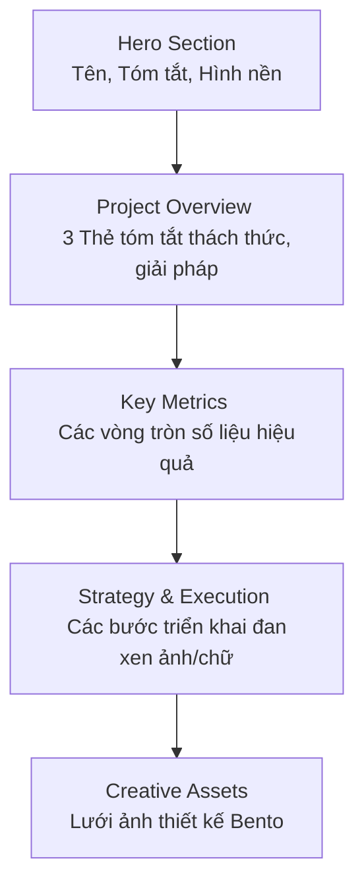

# 📖 Hướng Dẫn Nhập Liệu Dự Án (Project) Trên Strapi

Chào mừng bạn đến với tài liệu hướng dẫn sử dụng! Tài liệu này sẽ giúp người mới dễ dàng hiểu cấu trúc trang chi tiết Dự án (Project) và cách nhập liệu chính xác từ hệ thống quản trị **Strapi** để hiển thị lên Website một cách đẹp mắt nhất.

---

## 🎯 1. Tổng quan Cấu trúc Trang Chi tiết Dự án

Trang chi tiết dự án trên website được chia thành **5 phần chính (Sections)**. Bạn cần nắm rõ các phần này để biết dữ liệu mình nhập trên Strapi sẽ xuất hiện ở đâu.

---

## 📝 2. Các bước nhập liệu chi tiết trên Strapi

Đăng nhập vào trang quản trị Strapi, nhìn sang menu bên trái, chọn **Content Manager** > **Projects** > **Create new entry** để bắt đầu.

### 📍 Phần 1: Thông tin Cơ bản (Hiển thị ở Trang chủ & Hero Section)

Phần này chứa các thông tin tổng quan nhất. Nó quyết định dự án của bạn hiển thị ngoài trang chủ như thế nào, và phần đầu tiên của trang chi tiết (Hero) ra sao.

| Trường nhập (Field) | Hướng dẫn nhập liệu | Hình ảnh minh họa |
| :--- | :--- | :--- |
| **Title** | Tên chính của dự án.  *VD: Global E-commerce Campaign* |  |
| **Slug** | Đường dẫn URL của dự án. Hệ thống thường tự tạo dựa vào Title.  *VD: global-e-commerce* |  |
| **Category** | Thể loại dự án.  *VD: Marketing, Branding* |  |
| **Span Class** | Kích thước thẻ hiển thị ngoài trang chủ (span1, span2, span3).  *Mặc định: span1* |  |
| **Image** | Ảnh Thumbnail hiển thị ngoài trang chủ.  *(Tỉ lệ 16:9, dưới 500KB)* |  |
| **Eyebrow** | Tiêu đề phụ nằm trên cùng ở Hero Section.  *VD: Performance Marketing · 2024* |  |
| **Summary** | Tóm tắt ngắn gọn dự án (1-3 câu). Hiển thị ngay dưới Title. |  |

> **Mẹo:** Ảnh Thumbnail (Image) rất quan trọng vì nó là ấn tượng đầu tiên ở trang chủ. Hãy dùng ảnh chất lượng cao nhưng dung lượng nhỏ.

---

### 📍 Phần 2: Project Overview (Tổng quan Dự án)

Khu vực này thường hiển thị **3 thẻ** nằm ngang (Challenge, Solution, Results) để người xem nắm bắt nhanh logic của dự án.

**Thao tác:** Cuộn xuống phần `Overview` > Bấm **"Add new Overview-item"**.

Mỗi thẻ sẽ có 3 trường:
- **K (Số thứ tự/Nhãn):** *VD: 01, Bước 1*
- **Title (Tiêu đề thẻ):** *VD: Challenge*
- **Body (Nội dung chi tiết):** *Ghi khoảng 3-4 dòng mô tả.*

> **Lưu ý:** Nên tạo đúng **3 thẻ** để giao diện trên máy tính hiển thị thành 3 cột đẹp nhất (như thiết kế đã định).

---

### 📍 Phần 3: Key Metrics (Các chỉ số quan trọng)

Hiển thị các chỉ số thành công của dự án dưới dạng **Vòng tròn lấp đầy (Progress Rings)** và đếm số hoạt hình.

**Thao tác:** Cuộn xuống phần `Metrics` > Bấm **"Add new Metric"**.

Mỗi chỉ số gồm:
- **Prefix:** Ký tự trước số (VD: `+`, `$`)
- **Count:** Giá trị con số để chạy hiệu ứng (VD: `200`, `10`). **Lưu ý: Chỉ nhập số!**
- **Suffix:** Ký tự sau số (VD: `%`, `k+`, `M+`)
- **Label:** Tên chỉ số (VD: `ROI`, `Leads`)
- **Ring:** Mức độ lấp đầy vòng tròn. Nhập từ `1` đến `100`.

*(Ví dụ: Muốn hiển thị **+200% ROI** và vòng tròn lấp đầy 89% 👉 Prefix: `+`, Count: `200`, Suffix: `%`, Label: `ROI`, Ring: `89`)*

---

### 📍 Phần 4: Strategy & Execution (Chiến lược & Triển khai)

Khu vực này hiển thị tiến trình của dự án. Các bước sẽ tự động **hiển thị đan xen (zíc-zắc)**: Hàng lẻ ảnh bên phải, hàng chẵn ảnh bên trái.

**Thao tác:** Cuộn xuống phần `Phases` > Bấm **"Add new Phase"**.

- **Step:** Nhãn tiến trình (VD: `Phase 01`, `Tuần 1`)
- **Title:** Tiêu đề Giai đoạn
- **Body:** Nội dung chi tiết. Bạn có thể bôi đen và bấm **Bold (In đậm)** các từ khóa quan trọng để nhấn mạnh.
- **Image:** Ảnh minh họa cho giai đoạn này. Khuyên dùng ảnh tỉ lệ 4:3 hoặc 16:9.

---

### 📍 Phần 5: Creative Assets (Tài nguyên Hình ảnh)

Khu vực hiển thị ảnh dạng lưới Bento. Khi di chuột (hover) vào ảnh sẽ có lớp phủ mờ và hiện chữ giải thích.

**Thao tác:** Cuộn xuống phần `Assets` > Bấm **"Add new Creative-asset"**.

- **Category:** Phân loại ảnh (VD: `Social`, `Web`, `Video`)
- **Name:** Tiêu đề của ảnh
- **Description:** Đoạn chữ sẽ hiện ra khi người dùng di chuột (hover) vào ảnh.
- **Size:** Kích thước của ảnh trong lưới.
  - Chọn `normal` nếu ảnh dạng vuông (1:1).
  - Chọn `tall` nếu ảnh dạng dọc (3:4 hoặc 9:16) để thẻ kéo dài qua 2 hàng.
- **Image:** Tải ảnh lên.

> **Quan trọng:** Để lưới Bento hiển thị đẹp, hãy mix đan xen giữa ảnh `normal` và `tall`.

---

### 📍 Phần 6: Next Project (Dự án tiếp theo)

Ở cuối trang sẽ có nút chuyển sang dự án tiếp theo.
- **Next Project:** Bấm vào trường này và chọn một Dự án khác (đã được tạo trước đó) từ danh sách thả xuống.

---

## 🚀 3. Xuất bản (Publish)

Sau khi nhập liệu xong toàn bộ các trường:
1. Nhấn **Save** ở góc trên cùng bên phải màn hình để lưu lại (Dự án sẽ ở trạng thái *Draft*).
2. Nhấn **Publish** để công khai dự án lên website.

🎉 Chúc mừng! Dự án của bạn đã sẵn sàng và sẽ hiện lên tuyệt đẹp trên Website.
